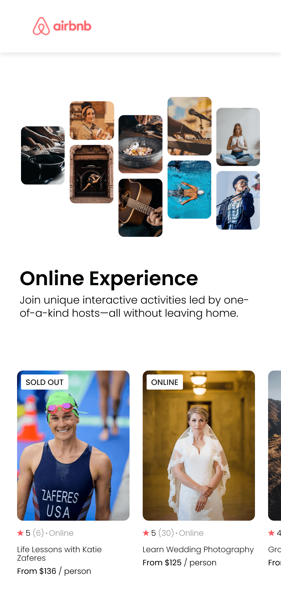

# airbnb experiences clone

A static clone page of airbnb experiences section built using React.

### Link
- [Live Site URL](https://kiran-m-p.github.io/airbnb-experiences-clone/)

### Screenshot

### What I learned

- Props
- Mapping data
- Destructuring assignment
- Spread Operator
